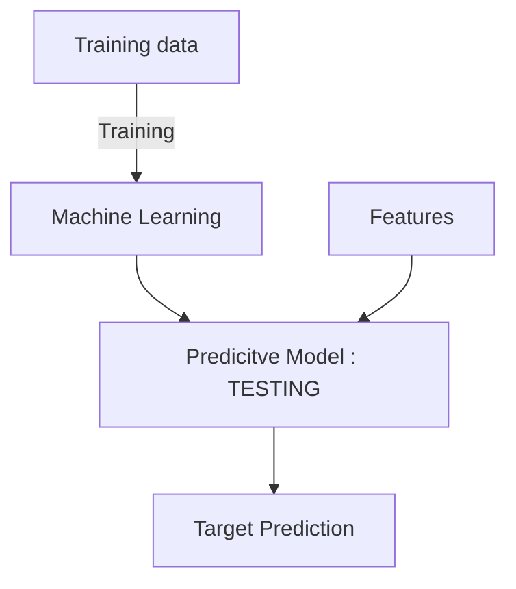

Python Libraries: 
	Neural Network (mostly convolutional Neural Networks)

- use cases of Predictive Analysis: __Tentative Project list__
- __digit recognition__ -> provide training data.

#### Machine Learning
	- target -> target features 
	- features -> descriptive features 
	- target + features -> examples (or) instances 
	- ML learns relationship between features and target

### Classification and Regression
### Decision Trees 
### Feature Engineering -> for deep learning (automate)

Requirements : 
Numpy 
Pandas 

# What is Machine Learning:
- __Converting experience into expertise by a machine.__
- __automatically learning a model(expertise) from the past data(experience) to make predictions__

- what is being predicted is called __target__(_target feature_)
- Data is presented in terms of __features__(_descriptive features_)
- pairs of features are called examples/instances.
- Machine learning learns relationship between features and target from given examples(_also called training data/training examples_)

# Predictive Analysis
- Building and using models to pedict 
- This necesarily does not mean temporal preiction but also mean predicting unknown value.

## business Applications:
- stock market predictions 
- Price Predictions (seasonal)
- loan prediction 
- fraudulent card transactions.

## Medical applications 
- Diagnosis 
- predicting disease susceptibility
- Predicting Prognosis
- Dosage Prediction 

## other applications
- Recognition of spoken words and written words 
- Document Classification

## Task : Digit Recognition 
- given image of a digit -> classifying the digit out of (0,9)
	- should recognize the number after considering the accent/writing style 
- How will the machine learn:
	- Training data of the numbers -> Machine Learn -> Learn model recognize digits 
